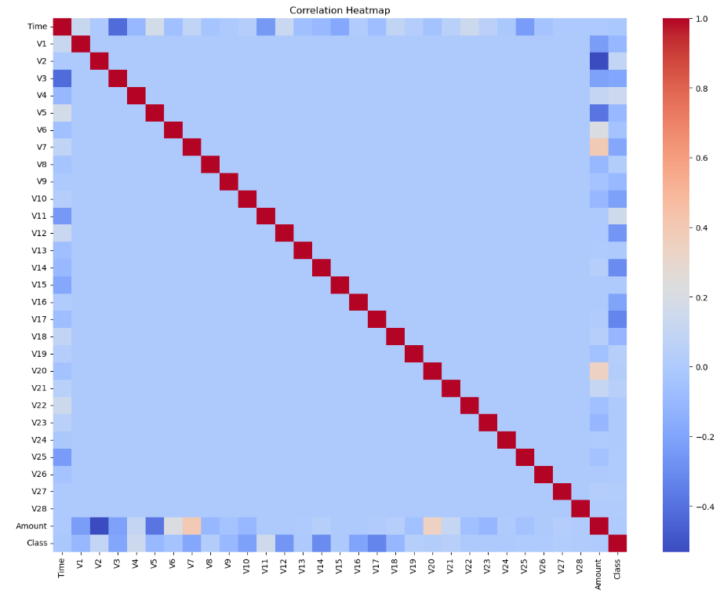
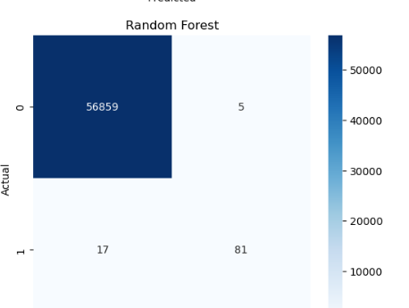
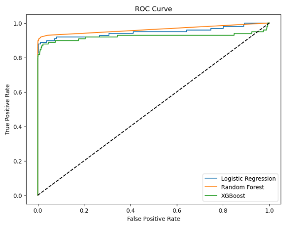
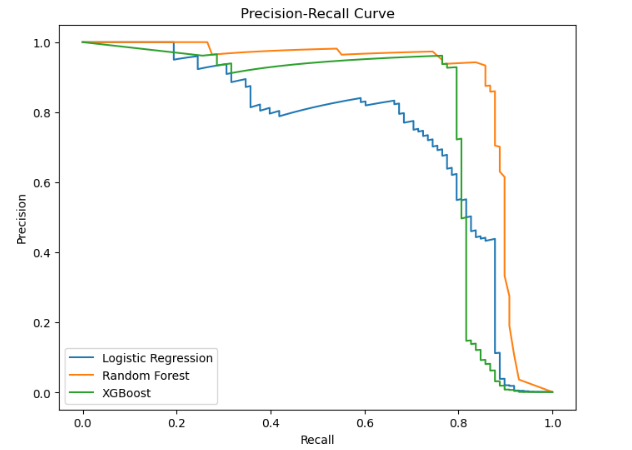
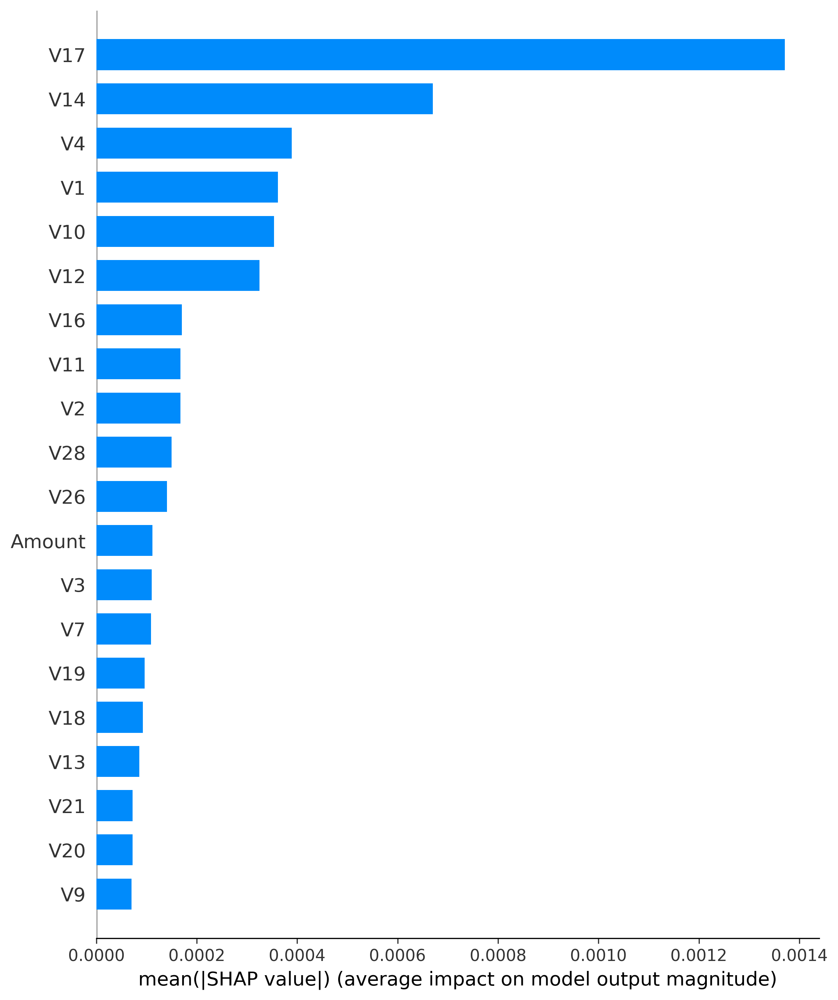
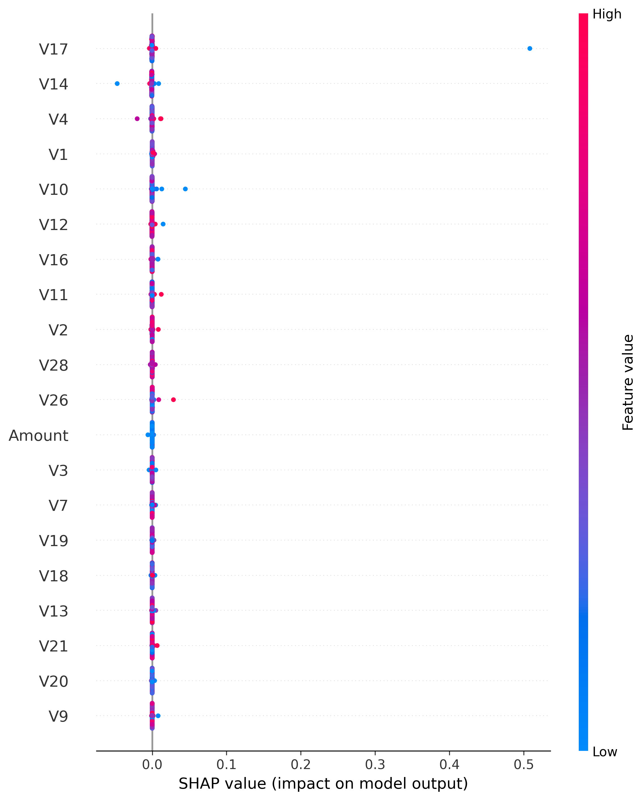

# 🛡️ FraudGuard AI: Real-Time Anomaly Detection Engine

An end-to-end machine learning pipeline and interactive web dashboard engineered to detect fraudulent credit card transactions in extreme class-imbalance environments.

🔗 [Try the Live Dashboard →]( https://creditcardfrauddetection-thxkiwl4gnzkeeouufxgcf.streamlit.app/)

---

# 📖 The "Accuracy Paradox" (Problem Statement)

In financial fraud detection, standard classification accuracy is a dangerous metric. In this dataset of 284,807 transactions, only 0.17% (492 cases) are fraudulent.

A baseline model that simply predicts "Normal" for every transaction achieves an accuracy of 99.83%, while allowing 100% of fraudulent activity to pass through undetected. This project abandons accuracy in favor of optimizing F1-Score, Precision, and Recall, balancing the detection of cybercrime against the operational cost of blocking innocent customers.

---

# 🧠 System Architecture & Engineering

### 1. Data Pipeline & Preprocessing

- **Feature Scaling:** Applied RobustScaler to normalize highly skewed and unbounded features (`Time` and `Amount`), ensuring extreme transaction values don't disrupt model gradients.
- **Stratified Partitioning:** Engineered train/test splits that strictly preserve the 99.83% / 0.17% class distribution across all validation subsets to prevent data leakage.
- **Dimensionality Reduction:** Leveraged pre-computed PCA components (V1 through V28) to maintain data privacy while capturing latent variance.

### 2. Algorithmic Evaluation & Tuning

Models were trained using algorithmic class penalization (`class_weight='balanced'` and `scale_pos_weight`) to force gradient optimization toward the minority class.

| Classifier Architecture | Precision | Recall (Sensitivity) | F1-Score | False Positives (Friction) |
|---|---|---|---|---|
| Baseline Logistic Regression | 0.06 | 0.92 | 0.11 | 1,389 |
| Tuned Logistic Regression | 0.16 | 0.89 | 0.27 | 460 |
| XGBoost Gradient Engine | 0.50 | 0.85 | 0.63 | 83 |
| 🏆 Random Forest (Ensemble) | **0.96** | **0.76** | **0.85** | **3 (Near-Perfect)** |

### 3. The Business Impact (Production Decision)

While Logistic Regression flagged the most total fraud (highest Recall), it generated 1,389 false alarms — enough to seriously damage customer trust and overload support teams.

The Random Forest Ensemble was chosen for production deployment because it achieved a 0.85 F1-Score, catching the majority of fraud while dropping false alarms down to just 3 instances out of ~57,000 transactions checked.

---

# 💻 Live Interactive Dashboard

The project features a sleek, dark-mode risk assessment portal built with Streamlit.

👉 [Launch the Dashboard](  )

**Dashboard Features:**

- **Real-Time Inference:** Adjust transaction parameters via UI sliders to see live risk probability outputs.
- **Dynamic Color-Coding:** Instant visual alerts distinguishing approved vs. intercepted transactions.
- **Analytics Engine:** Integrated Matplotlib and Seaborn visualizations comparing model benchmarks on logarithmic scales.

---

# 🚀 Local Deployment Guide

Follow these steps to run the pipeline and UI on your local machine.

### Prerequisites

- Python 3.9+
- Git

### Installation

```bash
# 1. Clone the repository
git clone https://github.com/ ADD YOUR GITHUB USERNAME HERE /Credit_Card_Fraud_Detection.git
cd Credit_Card_Fraud_Detection

# 2. Create and activate a virtual environment (recommended)
python -m venv venv
source venv/bin/activate        # On Windows: venv\Scripts\activate

# 3. Install dependencies
pip install -r requirements.txt
```

### Running the App

```bash
streamlit run app.py
```

The dashboard will open automatically at `http://localhost:8501`.

---

# 📂 Project Structure

```
Credit_Card_Fraud_Detection/
├── app.py                  # Streamlit dashboard entry point
├── data/                   # Raw and processed datasets
├── models/                 # Serialized trained models (.pkl)
├── notebooks/              # EDA & model experimentation notebooks
├── src/                    # Preprocessing & training pipeline scripts
├── requirements.txt        # Python dependencies
└── README.md
```

---

# 🛠️ Tech Stack

- **Language:** Python 3.9+
- **ML Libraries:** scikit-learn, XGBoost
- **Data Processing:** pandas, NumPy
- **Visualization:** Matplotlib, Seaborn
- **Web App:** Streamlit

---

# 📷 Project Screenshots

## Streamlit Home Page


---

## Prediction Dashboard


---

## Analytics Dashboard


---

## Class Distribution


---

## Correlation Heatmap



---

## Random Forest Confusion Matrix



---

## ROC Curve



---

## Precision-Recall Curve



---

## SHAP Feature Importance



---

## SHAP Beeswarm Plot



---

# 🔍 SHAP Explainability

SHAP (SHapley Additive exPlanations) was used to interpret the Random Forest model and identify the most influential features affecting fraud prediction.

This improves the transparency and interpretability of the machine learning model.

---

# 📈 Future Improvements

- Deep Learning Models
- Autoencoder-based Fraud Detection
- Hyperparameter Optimization
- Real-time API Deployment
- Docker Containerization
- Cloud Deployment
- Model Monitoring

---

# 👨‍💻 Author

**Atharva**

GitHub:
https://github.com/Atharva110409

LinkedIn:
<!-- TODO: Add your LinkedIn URL here -->
[ ADD LINKEDIN URL HERE ]

Email (optional):
<!-- TODO: Add contact email if you want -->
[ ADD EMAIL HERE ]

---

# 📄 License

<!-- TODO: If you have an MIT LICENSE file in the repo, keep this section and link to it. -->
<!-- Otherwise, remove this section and the License badge at the top. -->
This project is licensed under the [ ADD LICENSE TYPE ] License — see the [LICENSE](LICENSE) file for details.

---

# ⭐ If you found this project useful

Please consider giving it a ⭐ on GitHub.
